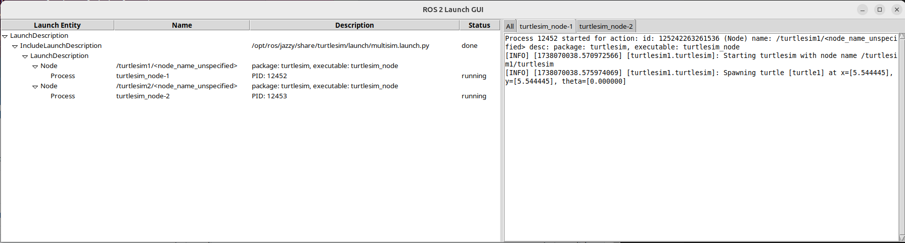
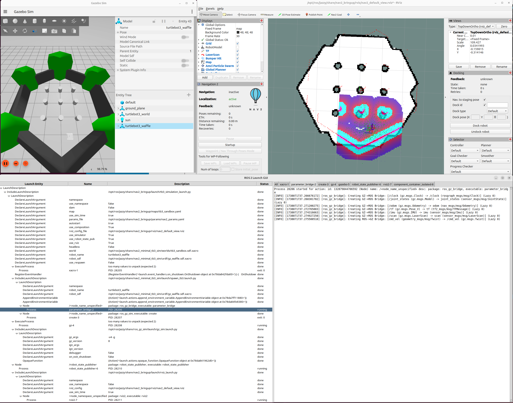

# ROS 2 Launch GUI

This package provides a Graphical User Interface for the ROS 2 Launch System.

The above screenshot is from running:

    ros2 launch -g turtlesim multisim.launch.py

On the left is a tree representation of the launch description while on the right, the output of each process is separated into tabs.

For a more complex example, here is a screenshot from the nav2 tutorial.

## Usage

So far, testing has been as a ros2 launch option. The design should allow for a DisplayUserInterface action to be manually added to a launch description, but this has not yet been tested.

### Command line option

An option is add to the `ros2 launch command for enabling a gui.

    ros2 launch --gui my_package my_launch.py

or

    ros2 launch -g my_package my_launch.xml

### DisplayUserInterface action

This is a work in progress...

## Design

The system interfaces with the launch system using the DisplayUserInterface action. This action will create a user interface and return actions from it.
The user interface will supply an event handler so the ui can react to launch events. The OnUserInterfaceEvent handler will forward events to the ui and respond to QueryUserInterface events to send pending events from the ui to the launch system.
In order for the ui to be able to send events to the launch system, TimerActions are used to periodically send QueryUserInterface events allowing the launch system to regularly check for new ui actions.
